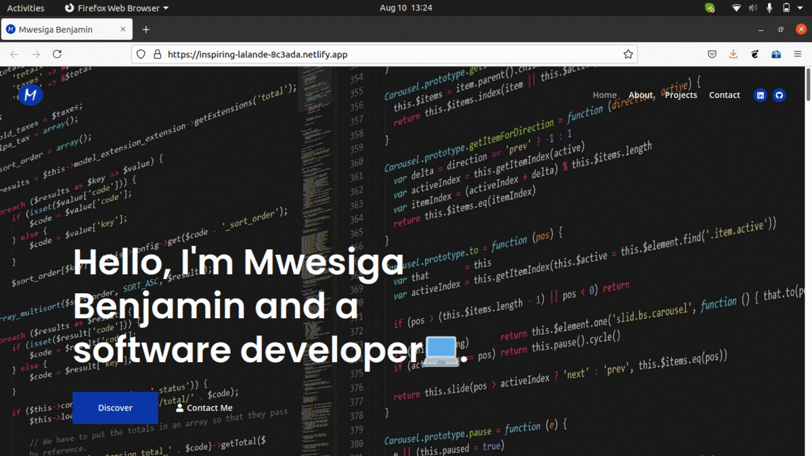

# Website Portfolio

Welcome! This is my beautiful website portfolio. This portfolio basically talks about me and the work I have done in my software development career.

## Authors

- [Mwesiga Benjamin (@mwesigab)](https://www.github.com/mwesigab)

## Badges

## Demo

This portfolio is hosted [here](https://inspiring-lalande-8c3ada.netlify.app). Check it out.

## Technologies Used

**Client:** HTML, CSS, JavaScript, Bootstrap

## GIFS & Screenshots

## 🚀 About Me

I'm a front-end developer who also loves to write some backend code in Java sometimes when required.

- Github: 
- LinkedIn: 
- Website: https://inspiring-lalande-8c3ada.netlify.app/

## 🛠 Skills

- Javascript, Java, Angular, React & React Native.
